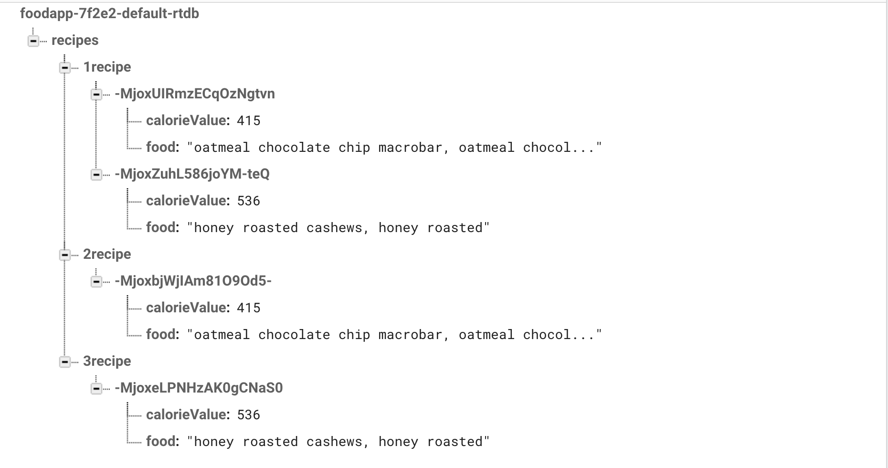
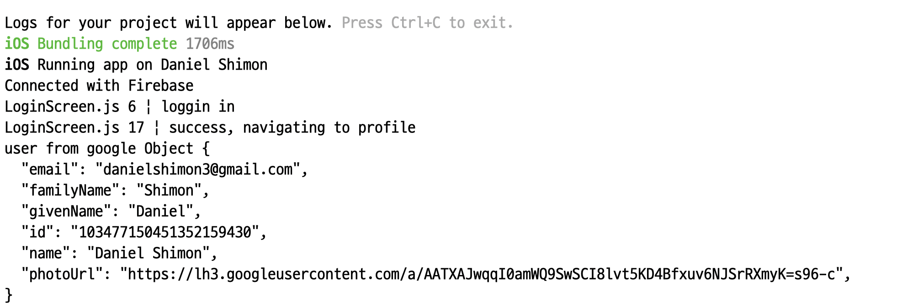

# Software Mini-Project - Senior Design
Authors: Daniel Shimon, Dabin Jang

Date: 2021-09-17
-----

## Summary

The main goal of this project is to build an application which will calculate calories of recipe or food that user eats. In order to build the application, there are three parts that we needed to figure out. Rest API, React-Native, and Google Firebase. 

React-Native is used to create the actual application that users can use on their phone. Two main reasons of choosing React-Native over other environments was it was straightforward to learn and both iOS and Android App are compatible with React-Native. We also used Expo because it is very easy to deploy to both iPhone and Android phones. These pictures were taken by implementing Expo’s Camera API. This API was able to give us information then used to reach the Rest API. This API is required to bring the food nutrition information from the FDA API which is given to us.Lastly, google firebase is used for backend of this application. By using firebase, we were able to store the information of the food that user takes picture of in a realtime database. We were also able to use and call User information in the application Users can also create multiple recipes to be stored in the backend. 

## Video Commentary
https://youtu.be/ChdpI8bdtps
The first screen is a google sign-in screen. This was the portion of the project that dealt
with User Authentication. The screenshot of the console showing all of the user info
accurately shows how we were able to authenticate the users. Now we are on the welcome screen
which accurately shows the users name. A button now takes us to the Home Screen of the application. Another button can take us to the Camera Screen. This is the main portion of the application.

There are three main buttons on this screen. The first will appear after we have scanned an
ingredient, and it says to scan another ingredient. The second allows us to start a new recipe. The third takes us to the ingredient screen.

We start off scanning one of our ingredients, which we show is registered in the database. Then we scan another ingredient, also  registered in the database. At this point the first recipe titled '1recipe' is finished and we can move on to the next one. By clicking the 'start  new recipe' button we can now add ingredients to the 2nd recipe. These are shown in '2recipe' and '3recipe'. The end result of the database can be found in the screenshots below.

Another functionality we added is that the user is able to go to the Ingredient Screen and see the name and calorie value of the last thing that they scanned, as seen at the very end of the video.

## Sketches and Photos

Real-Time Database:

Console showing Google Authentication:

## Supporting Artifacts

Code:

## Modules, Tools, Source Used

Expo
React Native
Google Firebase

## References
https://fdc.nal.usda.gov/api-guide.html
https://firebase.google.com/docs/database/web/read-and-write#update_specific_fields
https://medium.com/codingurukul/firebase-for-web-firebase-realtime-database-9280a52ced83
https://firebase.google.com/docs/reference/js/v8/firebase.database.Reference#methods
https://inaguirre.medium.com/react-native-login-with-google-quick-guide-fe351e464752
https://docs.expo.dev/guides/using-firebase/#storing-data-and-receiving-updates
https://medium.com/swlh/lets-create-mobile-app-with-react-native-and-firebase-6967a7946408#2329
https://javascript.plainenglish.io/react-native-firebase-email-authenticaton-in-an-expo-project-2e413e9a4890
https://docs.expo.dev/versions/latest/sdk/google/

## Improvements for the Future
This project is nowhere near perfect, however we are happy with the progress we were able to make. Many of the requested functionalities were able to be achieved, such as creating a basic React Native Cross-Platform Authentication, Google Sign-In Authentication, Implementing a camera into the application to read barcode information, Navigating through Screens, Reaching the API endpoint and making requested calls, and ultimately storing recipes for the individual users in a Firebase Backend (specifically Real-time Database). This was a very new project for both of us but we learned skills that we will be able to implement in the future. In the future, we would want to implement serving sizes, as well as displaying these recipes in the front-end of the application. Further we would like to make a more appealing UI as well.
-----
